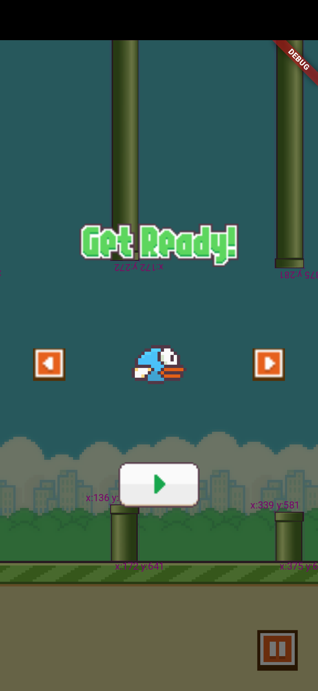
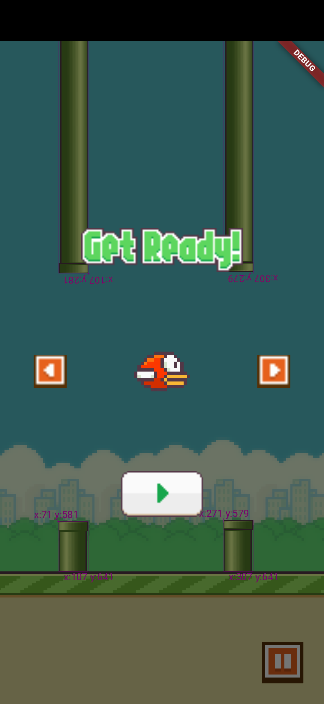

## 🐣 Inspiration

This game is a modern re-creation inspired by **Flappy Bird**, the legendary mobile game developed by Vietnamese indie developer **Nguyễn Hà Đông** in 2013. The original game’s simplicity, pixel-art charm, and unforgiving difficulty made it an instant viral phenomenon and a milestone in mobile gaming history.

# Flappy 🐤

A modern and lightweight implementation of the classic **Flappy Bird** game, built with Flutter and powered by the **Flame** game engine.All managed through clean and scalable **BLoC architecture**.

## Features

-   **State Management with BLoC, FlameBloc**:
-   **Animated Sprite**: Frame-by-frame animated sprites for smooth motion.

<div style="display: flex; justify-content: space-between;">
    
    
    
</div>

## Installation

1. **Prerequisites**:

    - Flutter SDK installed (version 3.0.0 or higher recommended).
    - A code editor (e.g., VS Code, Android Studio).
    - An emulator or physical device for testing.

2. **Clone the Repository**:

    ```bash
    git clone https://github.com/Huando22222/flappy.git
    cd flappy
    ```

3. **Install Dependencies and run the app**:
   `bash
flutter pub get
flutter run
`

<video width="100%" controls autoplay muted loop>
   <source src="assets/demo/demo_video.webm" type="video/webm">
 </video>
